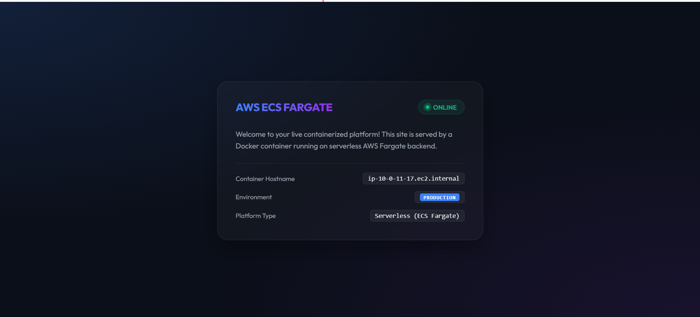

# AWS ECS Fargate Containerized Web Platform

A professional Cloud/DevOps project demonstrating how to containerize a web application and deploy it to a highly secure, serverless environment on AWS using Terraform (Infrastructure as Code) and Docker.

---

## 📸 Dashboard Preview



---

## 🏗️ Architecture

```text
               [ Public Internet ]
                       │
                       ▼ (HTTP Port 80)
        [ Application Load Balancer ] (Public Subnet)
                       │
                       ▼ (Security Group Gate)
     [ ECS Fargate Tasks (Containers) ] (Private Subnet)
                       │
                       ▼
        [ AWS ECR Image Registry ] (Pulls Docker Image)
```

### Key Infrastructure Components:
* **Custom VPC**: Configured with public subnets (hosting the Application Load Balancer) and private subnets (hosting the application containers).
* **NAT Gateway**: Placed in the public subnet to allow the private container instances to securely fetch updates and images without being directly exposed to the internet.
* **Security Isolation**: Fargate tasks are locked down using AWS Security Groups, permitting incoming traffic *only* from the Load Balancer on port 5000.
* **AWS ECR**: A private Elastic Container Registry holds the application's Docker image securely.
* **IAM Roles**: Custom task execution policies ensuring Fargate has minimum permissions required to pull images and stream stdout/stderr logs to Amazon CloudWatch.

---

## 🛠️ Technologies Used
* **IaC Tooling**: Terraform
* **Containerization**: Docker
* **AWS Services**: ECS Fargate, ECR, VPC, ALB, IAM, CloudWatch
* **Backend**: Python (Flask)
* **Shell**: PowerShell / Bash

---

## 🚀 How to Deploy

### 1. Build the Docker Image Locally
Navigate to the `app` folder and compile the container:
```bash
cd app
docker build -t ecs-web-app .
```

### 2. Initialize Terraform
Navigate to the root directory containing the `.tf` files and install the provider plugins:
```bash
cd ..
terraform init
```

### 3. Deploy ECR and Push the Container
Run a targeted apply to create the container registry, authenticate your local Docker CLI, and push the image:
```bash
# Deploy ECR
terraform apply -target=aws_ecr_repository.app

# Login to AWS ECR (Replace <aws_account_id>)
aws ecr get-login-password --region us-east-1 | docker login --username AWS --password-stdin <aws_account_id>.dkr.ecr.us-east-1.amazonaws.com

# Tag and Push the image (Replace <ecr_repository_url>)
docker tag ecs-web-app:latest <ecr_repository_url>:latest
docker push <ecr_repository_url>:latest
```

### 4. Deploy the Rest of the Stack
Deploy the VPC, security groups, Load Balancer, and ECS Fargate Service:
```bash
terraform apply
```
Once deployed, copy the `alb_dns_name` output and open it in your browser using `http://` to view the running dashboard.

---

## 🧹 Cleanup
To avoid ongoing charges on your AWS account, run the destroy command to delete all resources:
```bash
terraform destroy
```
